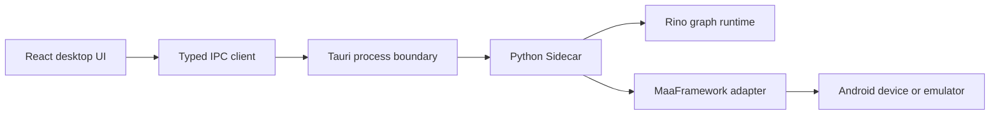

# Rino Lean Development Plan

> Status: Active local-desktop MVP specification
>
> Plan version: 0.4.0
>
> Last reviewed: 2026-07-27
>
> Target: Windows 10/11 x86-64 desktop application

## 1. Purpose and authority

Rino is a local desktop visual automation editor. Users create typed node graphs, run them through a Python runtime, and use MaaFramework for Android capture, OCR, and input control.

This document describes the product that remains in scope and the shortest path to a usable release. It is not a backlog for possible future products.

When requirements conflict, use this order:

1. The user's current explicit instruction.
2. The project-level AI instructions.
3. The protected frontend style guide for UI work.
4. This plan.
5. Current code, tests, and accepted architecture records.

Repository truth overrides stale status text. Do not read this plan for unrelated work unless the user names it or asks to implement it.

## 2. Product scope

### 2.1 Core outcome

A user can build and run this workflow without writing Python or Maa Pipeline JSON:

1. Connect an Android device or emulator through ADB.
2. Capture the current screen or a selected region.
3. Run OCR and inspect the recognized text, confidence, and rectangle.
4. Parse a finite number from text.
5. Compare it with another number.
6. Select a branch.
7. Click a point or the center of a recognized rectangle.
8. Inspect the ordered execution path, values, logs, and errors.
9. Save, close, reopen, and run the same project again.

### 2.2 Included product capabilities

- A self-contained Tauri desktop application; the editor never depends on an external browser.
- React, TypeScript, React Flow, shadcn/ui, Motion, and Zustand on the frontend.
- A supervised Python Sidecar as the only authoritative graph executor.
- The official MaaFramework Python binding behind Rino-owned interfaces.
- Local project persistence, autosave recovery, preferences, captures, and caches.
- Simplified Chinese as the primary UI language with an English fallback.
- Light, dark, and system theme modes.
- A typed node canvas with drag insertion, right-click search, marquee selection, inline fields, aliases, undo, and redo.
- A right workbench that shows the connected device or emulator and the selected-node inspector.
- A bottom panel for problems, logs, values, OCR results, and ordered execution history.
- Fake-backend tests and controlled Android acceptance.
- A packaged Windows build containing the required runtime components.

### 2.3 Permanent non-goals

Do not implement, scaffold, reserve UI for, or create placeholder services for:

- Cloud accounts, telemetry, analytics, or remote logging.
- Public script markets, authentication, payment, rating, or moderation systems.
- Plugin download or execution, whether signed or unsigned.
- Arbitrary Python, JavaScript, shell, PowerShell, native code, or raw Maa action JSON in user graphs.
- Multi-user real-time collaboration.
- Mobile authoring UI.
- A general image editor or traditional IDE replacement.
- Pixel-level imitation of any existing commercial editor.
- In-app application or MaaFramework download/update services.
- MAA agent hosting, ecosystem package export, or a second runtime host.

Any later request for an excluded capability requires a new user-approved plan. It must not expand this MVP implicitly.

## 3. Product and technical decisions

| Topic | Decision |
|---|---|
| Product model | Rino-owned typed visual graph |
| Runtime authority | Python Sidecar |
| Automation backend | Official MaaFramework Python binding |
| Maa usage | Direct controller and recognition APIs; no Pipeline compilation |
| Desktop shell | Tauri 2 with least privilege |
| Frontend | React, strict TypeScript, React Flow, shadcn/ui, Motion, Zustand |
| First device target | Android devices and emulators through application-owned ADB |
| First OCR target | Common Simplified Chinese and English text and numbers |
| Project format | Project directory with manifest, graph objects, and asset objects |
| Release architecture | Windows x86-64 first |
| Networking | No product networking |
| User code | Typed built-in nodes only |

MaaFramework is replaceable. Graph schemas, scheduling, numeric parsing, comparison, branching, cancellation, persistence, and UI behavior must not depend on Maa Pipeline semantics.

## 4. Application architecture



### 4.1 Frontend responsibilities

- Render and edit the graph.
- Validate obvious authoring mistakes for immediate feedback.
- Show device preview, overlays, properties, execution state, values, and errors.
- Send typed requests and reject stale responses.
- Never implement a second graph execution semantics.
- Never execute operating-system commands directly.

### 4.2 Tauri responsibilities

- Own the desktop window and application directories.
- Start, supervise, restart, and stop the Sidecar.
- Enforce command and filesystem allowlists.
- Transport framed IPC without interpreting graph semantics.
- Expose only narrowly scoped native commands.

### 4.3 Python responsibilities

- Parse and validate graph documents.
- Own the node registry, scheduler, cancellation, values, logs, and errors.
- Serialize device-affecting operations per device.
- Own image handles and bounded runtime artifacts.
- Normalize MaaFramework results and callbacks before IPC.

### 4.4 MaaFramework adapter responsibilities

- Discover and connect supported ADB devices.
- Capture the screen.
- Run the fixed OCR capability.
- Click a point or rectangle center.
- Report bounded operation state and sanitized errors.
- Never expose shell, command, custom-action, plugin, generic model, or arbitrary task capabilities.

## 5. Graph model and execution

### 5.1 Model separation

Keep these models separate:

- Persistent graph document.
- Editable frontend domain state.
- React Flow render state.
- Frozen runtime graph snapshot.
- Runtime values and artifacts.

Persist domain data only. Do not persist React Flow internals, temporary selection, viewport animation, device identity, runtime values, preview tokens, image handles, or local cache paths.

### 5.2 Node and edge rules

- Every node has a stable UUID, `typeKey`, type version, position, properties, literal inputs, and optional user alias.
- Every port has a stable ID, direction, execution/data kind, data type, and cardinality.
- Execution edges carry order only.
- Data edges carry typed values only.
- Invalid direction, kind, type, or cardinality is rejected before execution.
- User aliases never change type identity or execution behavior.
- Incomplete graphs may be saved but cannot run until executable validation passes.

### 5.3 Runtime values

Initial value types:

- Boolean.
- Finite IEEE-754 binary64 number.
- Bounded string.
- Point and rectangle with coordinate-space metadata.
- Image reference backed by a runtime-owned handle.
- OCR candidate and OCR result.
- Bounded collections where already required by OCR results.

Large images never enter JSON, logs, broad frontend state, or persistent graph documents.

### 5.4 Scheduler semantics

The MVP scheduler executes one frozen graph revision using a deterministic token queue:

1. Validate the graph and entry node.
2. Create the run, frame, cancellation scope, value store, artifact scope, and limits.
3. Enqueue the entry token.
4. Before each activation, check cancellation and limits.
5. Resolve connected inputs and pure dependencies.
6. Emit ordered node-start state.
7. Execute the node.
8. Atomically commit bounded outputs and logs.
9. Emit node completion or failure.
10. Traverse selected execution outputs in deterministic order.
11. Finish when the queue is empty, a terminal node ends the run, cancellation completes, or an unhandled failure occurs.

Independent branches do not run concurrently in the MVP.

### 5.5 Outcome classes

| Class | Examples | Behavior |
|---|---|---|
| Expected outcome | OCR no match, invalid number, comparison false | Typed value or explicit branch; run continues |
| Operational failure | Disconnect, capture failure, OCR timeout | Structured run failure |
| Graph error | Missing input, invalid type/property | Block before run when possible |
| Protocol/runtime defect | Malformed IPC, invalid executor output | Fail safely with bounded diagnostic |
| Cancellation | User cancels active run | Distinct cancelled terminal state |
| Unknown action outcome | Sidecar or device failure after click dispatch | Fail as non-retryable; never replay automatically |

## 6. Node catalog

### 6.1 Rino core nodes

| Type key | Purpose |
|---|---|
| `core.flow.start` | Start the graph |
| `core.flow.stop` | End the current execution path |
| `core.flow.sequence` | Traverse outputs in deterministic order |
| `core.logic.branch` | Select true or false execution output |
| `core.logic.numberCompare` | Compare two finite numbers with an exact operator |
| `core.value.numberLiteral` | Provide a finite number |
| `core.value.stringLiteral` | Provide bounded text |
| `core.time.delay` | Wait for a cancellable bounded duration |
| `core.diagnostic.log` | Add a bounded local log entry |
| `text.parseNumber` | Parse text through explicit numeric-format rules |

### 6.2 Maa-backed nodes

These four type keys are the complete MVP backend allowlist:

| Type key | Purpose |
|---|---|
| `automation.captureScreen` | Capture the current raw-size screen |
| `vision.ocr` | Run the fixed OCR recognizer on an image and optional ROI |
| `automation.clickPoint` | Click a validated point |
| `automation.clickRectCenter` | Click the center of a validated rectangle |

Maa capability discovery may mark one of these nodes available or unavailable. It cannot create more node types or recognition methods.

### 6.3 Number semantics

- Accept optional sign when enabled.
- Support explicit decimal and grouping separators.
- Support optional full-width digit normalization.
- Reject NaN, infinity, overflow, currency interpretation, percentage conversion, malformed grouping, and silent locale guessing.
- Enforce optional finite minimum and maximum bounds.
- Comparison uses the parsed binary64 value without hidden rounding or tolerance.
- Equality is exact. Approximate equality would require a different future node.
- Invalid parsing selects the explicit invalid path and never produces a number output.

### 6.4 OCR candidate selection

- Preserve bounded candidates with text, confidence, and rectangle.
- A no-match result is successful execution with `matched=false`.
- Select the highest-confidence candidate for `bestText` and `bestRect`.
- Resolve equal confidence by original reading order.
- Never persist OCR source pixels or full runtime results automatically.

## 7. MaaFramework integration

- Pin the binding, native runtime, agent binary dependency, and OCR asset versions as one tested unit.
- Use the official Python binding and verified direct APIs.
- Keep framework logging, debug images, error captures, and stdout logging disabled.
- Use an application-owned ADB executable; never fall back silently to `PATH`.
- Keep physical ADB paths and addresses inside the adapter.
- Give the UI only opaque device keys and safe display metadata.
- Register only reviewed controller and Tasker callback messages.
- Redact raw Maa callback details before they reach IPC.
- Remove callback sinks and retire generations on disconnect, replacement, failed connection, and shutdown.
- Keep blocking native work off the Python event loop.
- Check cancellation immediately before a non-idempotent click dispatch.
- Never retry a click whose outcome is unknown.

Changing the bundled MaaFramework version is an application release task and must repeat import, device, capture, OCR, click, cancellation, callback, packaging, and license checks.

## 8. IPC and Sidecar lifecycle

### 8.1 Transport

- Framed standard input/output uses a four-byte big-endian length prefix followed by UTF-8 JSON.
- Standard output contains protocol bytes only.
- Every request has a request ID, versioned payload, typed result, and structured error.
- Both sides validate every message.
- Frame, queue, payload, retry, and timeout limits are explicit.
- A malformed or oversized frame invalidates the current Sidecar generation safely.

### 8.2 Required requests

- Handshake, health, and shutdown.
- Registry get and graph validate.
- Run start and cancel.
- Device list, connect, and disconnect.
- Preview capture/release and approved capture preparation/release.

### 8.3 Required events

- Runtime and device state changes.
- Run, node, and traversed-edge state.
- Bounded logs and diagnostics.
- Normalized automation operation states.

Events carry monotonically ordered local sequences. The frontend rejects events from stale runs or Sidecar generations.

### 8.4 Lifecycle

The Sidecar has explicit starting, ready, degraded, stopping, stopped, and failed states. Shutdown must cancel work, release device sessions and callback sinks, close artifact scopes, and terminate the process tree. The frontend remains responsive and can still request cancellation while native work is active.

## 9. Project persistence

### 9.1 Directory layout

```text
project-root/
  project.rino.json
  graphs/
    objects/
      <sha256>.rino.graph.json
  assets/
    objects/
      <sha256>.<extension>
```

The manifest references graph IDs, relative object paths, hashes, and asset metadata. Device IDs, runtime state, caches, logs, autosaves, AI files, and local paths are not project content.

### 9.2 Save behavior

- Write new immutable graph and asset objects first.
- Flush and verify each object before publishing the manifest.
- Atomically replace the manifest last; it is the transaction commit point.
- Keep the previous valid state if save fails.
- Detect external modification and multiple writers before replacing the manifest.
- Validate all relative paths and reject traversal, reparse-point escape, and symlink escape.
- Use deterministic serialization and explicit schema versions.
- Keep autosave and recovery outside the user project directory.

### 9.3 Captures

- Full and selected-region capture require explicit user confirmation.
- Manual names use Unicode NFKC normalization, trimming, and invariant case comparison.
- Duplicate normalized names are rejected without overwriting anything.
- Automatic names are deterministic and collision-safe.
- Approved captures enter content-addressed project storage atomically.
- Unapproved previews and temporary captures expire and never enter the project.

## 10. Desktop UX requirements

### 10.1 Layout

- Top bar: project, device, save, run, cancel, theme, and global actions.
- Left: searchable categorized node library and drag sources.
- Center: dominant graph canvas.
- Right upper: device/emulator preview and overlay tools.
- Right lower: selected-node inspector.
- Bottom: problems, logs, values, OCR, and execution history.

Panels are resizable and collapsible. Preserve layout preferences locally. The graph remains usable at the minimum supported window and across 100-200 percent Windows scaling without root transform scaling.

### 10.2 Node authoring

- Drag a node or workflow template from the library to the exact canvas position.
- Right-click empty canvas to open categorized Chinese/English quick search.
- Primary-button drag on empty canvas creates a marquee selection rectangle.
- Typed ports reject invalid connections before commit.
- Node titles show Chinese first and English second.
- Users can add an alias without changing node identity.
- Essential string and number literals are editable directly inside the node.
- Every button, node, port, and non-obvious field has concise hover help.
- Use one bundled Lucide icon mapping; never use emoji or AI-generated icons.

### 10.3 Node visual structure

- Compact icon and bilingual title header.
- Input ports on the left and output ports on the right.
- Ports align with the functional row they represent, not an unrelated footer.
- Execution ports remain visually distinct from data ports.
- Category identity uses a restrained accent, not a saturated full-node fill.
- Running, success, and failure use icons and text/state shape in addition to color.
- Only the active node and active execution path may animate continuously.
- Completed execution paths remain as quiet ordered traces until reset.

### 10.4 Device preview and selection

- Show connection, logical resolution, scale, refresh state, frame age, and pause/resume.
- Support fit, zoom, pan, one-to-one pixels, and reset.
- Preserve aspect ratio and account for letterboxing.
- Transform ROI, points, rectangles, and result overlays through explicit source coordinates.
- Allow full-frame or selection capture with preview, naming, dimensions, and destination confirmation.
- Support `Pick from device view` for compatible ROI, point, rectangle, and image fields.
- Pause or throttle preview work when hidden, minimized, busy, or harmful to canvas responsiveness.

### 10.5 Motion, themes, and accessibility

- Follow the protected frontend style guide.
- Use warm-neutral, restrained dark surfaces rather than bright blue-black panels.
- Use semantic tokens for every color.
- Keep text and icons crisp at supported scale factors.
- Use purposeful interruptible motion for feedback and spatial continuity.
- Respect reduced-motion and provide a static equivalent for execution order.
- Maintain visible focus, keyboard navigation, accessible names, tooltips, and non-color status cues.
- Allow at least 30 percent text expansion for localization.

### 10.6 Core shortcuts

| Action | Default |
|---|---|
| Save / Save As | `Ctrl+S` / `Ctrl+Shift+S` |
| Undo / Redo | `Ctrl+Z` / `Ctrl+Y` |
| Copy / Paste / Duplicate | `Ctrl+C` / `Ctrl+V` / `Ctrl+D` |
| Delete selection | `Delete` |
| Quick add node | `Tab` |
| Search node library | `Ctrl+K` |
| Fit graph / frame selection | `Home` / `F` |
| Pan canvas | `Space` plus primary drag |
| Run / Cancel | `F5` / `Shift+F5` |
| Focus device view | `Ctrl+Shift+D` |
| Shortcut reference | `Ctrl+/` |

Settings contains a searchable shortcut reference card. Global shortcuts never override text editing or IME composition.

## 11. Security, privacy, and performance

### 11.1 Security and privacy

- Operate offline.
- Do not collect telemetry or send project data anywhere.
- Treat projects, IPC, images, OCR text, and backend data as untrusted.
- Never store secrets in source, logs, archives, project memory, or fixtures.
- Keep Tauri permissions and command allowlists minimal.
- Do not load remote scripts, fonts, images, frames, or styles.
- Do not load project-provided Python modules, DLLs, executables, or plugins.
- Keep screenshots and OCR data local and bounded.
- Redact physical device IDs, user paths, raw backend payloads, and image handles from frontend-facing errors and logs.

### 11.2 Performance

- Keep graph callbacks, node types, edge types, and selectors stable.
- Subscribe to narrow React/Zustand state slices.
- Do not place large images in broad reactive stores.
- Throttle high-frequency preview and runtime events.
- Bound image caches, queues, logs, histories, retries, and runtime values.
- Avoid blur, large shadows, and continuous animation on repeated nodes.
- Prioritize pointer response and graph manipulation over preview frame rate.
- Measure release performance on realistic 500-node scenes and supported DPI values.

## 12. Testing and release gates

### 12.1 Automated checks

- TypeScript: type checking, lint, unit/component tests, accessibility checks, and production build.
- Python: Ruff, strict production type checks, unit tests, scheduler tests, fake workflow tests, and Maa adapter tests.
- Rust: formatting, Clippy, unit/integration tests, Sidecar fault injection, and project I/O tests.
- Contracts: shared valid/invalid fixtures and deterministic regeneration.
- Desktop: Tauri-window smoke tests; browser-only preview is not release evidence.

### 12.2 Numeric workflow matrix

The reference graph covers:

- Greater than, equal to, and lower than the threshold.
- Negative and decimal values.
- Full-width digits when enabled.
- No OCR match.
- Multiple candidates, including equal-confidence reading-order behavior.
- Invalid or ambiguous numbers.
- Disconnect before action.
- Cancellation during OCR and before click dispatch.
- Unknown click outcome without automatic retry.
- Save, reopen, and run.
- Stale Sidecar generation rejection.

### 12.3 Controlled Android gate

With a sanitized emulator or physical device, verify discovery, connection, capture, OCR, coordinate mapping, safe click, disconnect, cancellation, and Sidecar restart. Do not retain device IDs, screenshots, user data, or private paths as release evidence.

### 12.4 Windows package gate

- Bundle Python, MaaFramework, OCR assets, audited ADB payload, required native libraries, and notices.
- Do not depend on system Python, global Maa installation, or PATH ordering.
- Verify clean install, launch, use, upgrade by installer replacement, uninstall, and cache cleanup.
- Test supported Windows versions and scale factors.
- Sign public release binaries and installers. Unsigned builds are local/test only.
- Generate reviewed dependency inventory, notices, hashes, and SBOM.

## 13. Current implementation state

Completed foundations include:

- Desktop shell, design system, localization, application frame, graph editor, typed connections, project persistence, and recovery foundations.
- Canonical graph, registry, IPC, diagnostics, and artifact contracts.
- Python graph validation, node registry, scheduler, cancellation, fake backend, runtime IPC, and execution visualization data.
- Pinned MaaFramework binding, Android lifecycle, direct capture, direct OCR, safe click, image handles, previews, captures, and callback normalization.

Remaining work, in order:

1. Finish the compact numeric workflow semantic acceptance matrix without introducing new architecture.
2. Complete OCR, click, preview/capture, naming, numeric-node, tooltip, shortcut, and operation-state presentation using existing contracts.
3. Run the complete fake-backend and controlled Android workflow.
4. Resolve any verified cross-language regressions.
5. Package and validate the self-contained Windows application.
6. Finish concise user documentation and known limitations.

Do not start optional features while any item above remains incomplete.

## 14. Definition of done

A task is complete only when:

- It implements the requested behavior without unrelated expansion.
- Relevant callers, contracts, failure paths, and tests were reviewed.
- Focused tests pass.
- Relevant broader tests and static checks pass.
- No validation or test was weakened.
- Frontend work satisfies theme, localization, keyboard, tooltip, focus, reduced-motion, responsive, and performance requirements.
- No private path, capture, credential, local AI file, or user data enters tracked output.
- The final diff contains no unrelated refactor, placeholder, dead code, debug output, or accidental dependency change.
- The final Chinese summary distinguishes passed, failed, and unrun checks and states remaining hardware or packaging gates.

The MVP is complete when a user can build, save, reopen, and run the reference workflow in the packaged Tauri application; observe each decision; control a supported Android target safely; and use the editor fluently without external browser, text scripting, cloud service, plugin, or speculative subsystem.
